# Welcome to the METS-R simulator!

METS-R ADDSEVS simulator is a high fidelity, parallel, agent-based evacuation simulator for **multi-modal energy-optimal trip scheduling in real-time (METS-R)** at transportation hubs.It consists of two modules. The first one is the traffic simulator module; the second one is the high-performance computing (HPC) module.

# 1 Overall framework

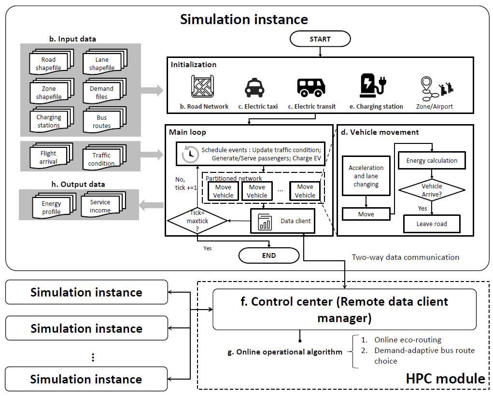


# 2 Installation

## 2.1 Building and running the simulator

1. Download and install *Eclipse IDE for Java Developers* from [here](http://www.eclipse.org/downloads/packages/release/2021-03/r/eclipse-ide-java-developers).
2. Install *Repast Simphony* plugin in Eclipse using the instructions provided [here](https://repast.github.io/download.html#update-site-install).
3. Clone the METS-R repository using `git` to a suitable location.
    
    ```
    git clone <https://github.com/umnilab/METS-R_ADDSEVS/>
    ```
    
4. Open Eclipse and go to File -> *Open Projects from File System…*
5. In the *Import Projects from File System or Archive* window click on *Directory* and open the *ADDSEVS* directory you cloned in step 3.
6. Under *Folder* check *ADDSEVS* only and click *Finish*. This should open the METS-R java code in Eclipse as shown in the following figure.   
    
    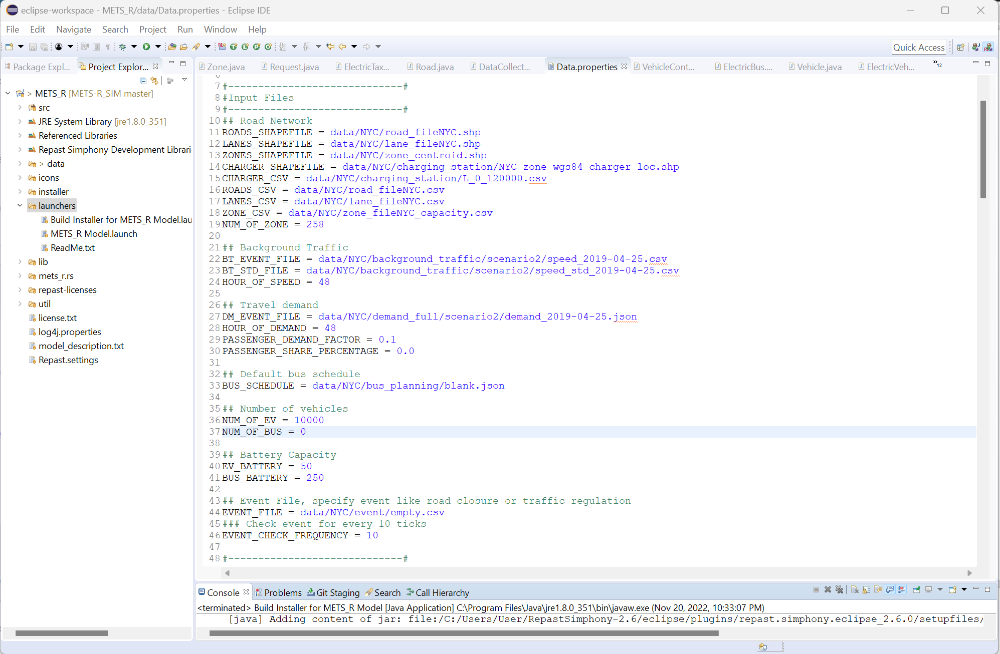                                                        
    
7. If required, modify the inputs of the simulation run scenario according to your needs in the configuration file ( `ADDSEVS/data/Data.properties`).
8. Go to *Run -> Run Configurations.*
9. In *Main* tab use (These values may be auto-filled, in that case, skip steps 9 and 10).
    
    ```
    Project : ADDSEVS
    Main class : repast.simphony.runtime.RepastMain
    ```
    
10. In *Arguments* tab use (note that VM arguments can be changed depending on the available memory on your machine).
    
    ```
    Program Arguments : "${workspace_loc:ADDSEVS}/ADDSEVS.rs"
    VM arguments : -Xss1024M -Xms1024M -Xmx8G
    ```
    
11. Click Run and you should see the below *Repast Symphony* simulation window (You can also use *Run* button in the toolbar).
    
    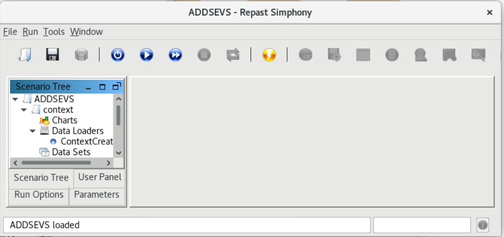
    
12. Click on *Initialize Run* (power) and then the *Start Run* button to begin the simulation.

The above steps only run the traffic simulator (built-in Java) without the HPC module. In order to run the HPC module, please follow the steps in *[Running simulation with HPC module]*.

## 2.2 Running simulation with HPC module

To run the HPC module, you need to first download and build the simulator by following the steps in *[Building and Running the Simulator](https://www.notion.so/Doc-METS-R-c214ed52a2234f9783bee2bedb3d4615).*

**NOTE** : HPC module is only tested on Ubuntu/Linux machines.

### 2.2.1 Running HPC module

1. You must download the `METSR_HPC` code to run the HPC module.
    
    ```
    git clone git@github.com:umnilab/METSR_HPC.git
    cd METSR_HPC
    ```
    
2. View the HPC configuration json file. Currently, this HPC module consists of 3 modules: eco-routing, bus-scheduling, and ridesharing. As shown in the figure below, all configuration parameters are defined at `run.config.scenario.json`.   
    
    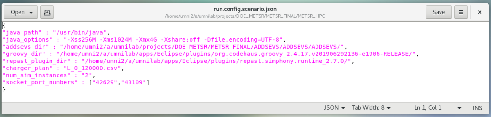
    
3. Modify the existing `run.config.scenario.json` file with the configurations you want:
    - `java_path` - set the absolute path of your java installation.
    - `java_options` - change the jvm memory limits depending on your machine specs.
    - `addsevs_dir` - the absolute path of ADDSEVS directory.
    - `groovy_dir` - the absolute path of your groovy installation.
    - `repast_plugin_dir` - absolute path pf your repast plugin installation.
    - `charger_plan` - the charging plan for EVs.
    - `num_sim_instances` - number of parallel simulation instances you need to run.
    - `socket_port_numbers` - specify a list of free socket port numbers in your machines separated by a comma. You need to specify N ports where N is the number of parallel simulation instances you want to run. If you don't know free port numbers, run `FindFreePorts.java` using eclipse. This will print up to 16 free ports numbers available in your machine.
4. Finally, run
    
    ```
    python3 run_hpc.py -s 0 -c 0 -p 1 -e -b
    ```
    
    - `-s 0` means the scenario index is 0. The available indexes are 0,1,2 and 3.
    - `-c 0` denotes that the case index is 0. It can range from 0 to 9.
    - `-p 1` shows that ride-sharing module is performed and the ridesharing percentage is 100%.
    - `-e` means the eco-routing module is open.
    - `-b` means the bus scheduling module is open.
5. This will start the simulation instances in parallel and run RDCM. All the files related to each simulation run will be created in a separate directory `eco_true_bus_true_share_100/scenario<i>/<j>_<k>` , where `i` means i'th scenario index, `j`  is j'th case index, and `k` represents the k’th instance index. You should see several log files and output folders as shown in the following figure.
    
    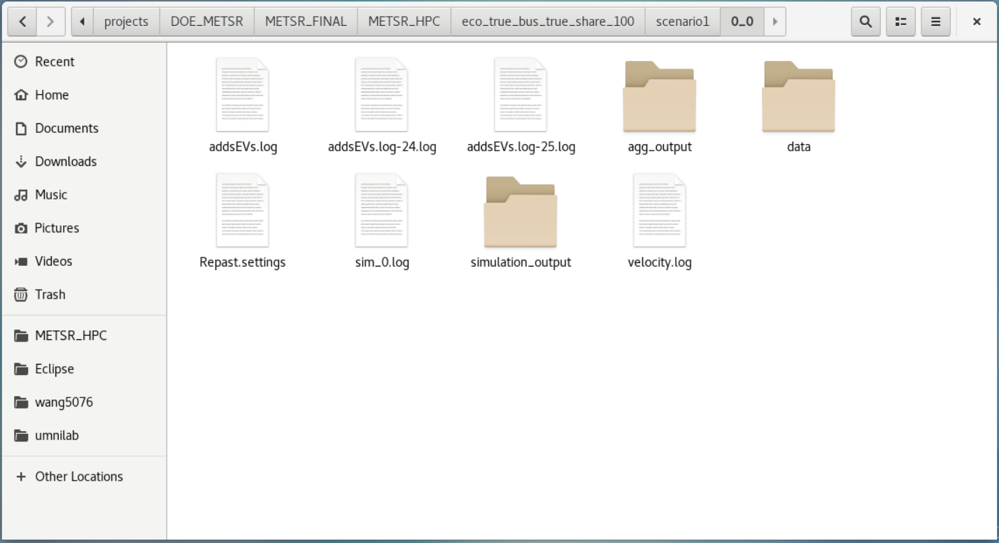
    

### 2.2.2 Advanced options: change demand files data preparation

1. The demand prediction module is hosted in METRS_HPC repo. Clone it if you have not done that.
2. Download and process the data required to train the models.
    
    ```
    git clone git@github.com:tjleizeng/METSR_HPC.git
    cd demand prediction
    python 1.Download_NewYork_Taxi_Raw_Data.py
    python 2.Process_NY_Taxi_Raw_data.py
    ```
    
3. You can change the `hub` variable in `2.Process_NY_Taxi_Raw_data.py` in order to get the prediction for different hubs (i.e. `PENN`, `JFK`, `LGA`).
4. Train the model and generate the prediction `.csv` file.
    
    ```
    python PCA_aggregation_RF_prediction.py
    ```
    
5. Same as before, change the `hub` variable as necessary. This will train the prediction model and write the prediction result to a file named `<HUB>PCA.csv`.
6. Java class `DemandPredictionResult.java` can be used to query the prediction result from within the simulator code. There are two main functions in this class:
    - `public double GetResultFor(String hub, String date, int hour, int taxiZone)` : This function can be used to query the prediction result. You need to specify the following to get the prediction result
        - `hub` : demand hub name (i.e. `PENN`, `JFK`, `LGA`)
        - `date` : use the format `<year>-<month>-<date>` (eg. `2018-12-31`)
        - `hour` : hour of the day 1-24
        - `taxiZone` : taxi zone number
    - `public void RefreshResult()` : Use this function to repopulate the prediction result from the `.csv` file. This is useful if you want to update the demand prediction while the simulator is also running.

### 2.2.3 Advanced options: utilize prepared bus scheduling files without gurobi license

1 It should be noted that the bus scheduling module in the HPC part utilizes the gurobi package to solve the optimization problem. If users want to use the bus scheduling module, users need to install the packages of gurobi provided [here](https://www.gurobi.com/documentation/9.5/quickstart_mac/cs_python_installation_opt.html) and lapsolver provided [here](https://pypi.org/project/lapsolver/). 

2 If the user do not have gurobi license, please modify the [rdcm.py](http://rdcm.py) file to use the prepared bus scheduling data `bus_scheduling_read` to run the simulation.  

```
bus_scheduling_read_raw = open(bus_scheduling_read)
busPlanningResults = json.load(bus_scheduling_read_raw)
```

# How it works

# 3. Structure of METS-R simulator

METS-R simulator is written in `java` and it consists of various classes to represent different entities in a transportation network. This section describes the main components of the simulator including the variables and functionalities of the important classes used.

## 3.1 Framework

As shown in the following figure, the traffic simulator contains the input data, simulation, output data, and control center (connection to the HPC module). 

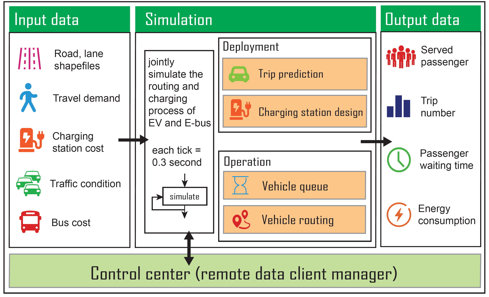


## 3.2 Data

### 3.2.1 Input data

All the required inputs for running the simulation are listed and described in the configuration file `~/ADDSEVS/data/Data.properties`. The paths of the input data are provided in the first section of the file. Below are the details of each input:

1. `Zone shapefile (Point)`: the locations of origins/destinations of all demand. One also needs to specify the number of zones in `NUM_OF_ZONES`  in `Data.properties` and which zones are corresponding to the hubs in the variable  `HUB_INDEXES` in `addsEVs.GlobalVariables.java`. For example, `HUB_INDEXES=[131,140,180]` means the 131th row (JFK), 140th row (LGA), and 180th row (PENN) of the zone shape are corresponding to transportation hubs. 
2. `Charging station shapefile (Point)`:  similar to the zone shapefile, this is the shapefile for charging stations. For a given scenario, a CSV file needs to be specific for the variable `CHARGER_CSV` to configure the chargers in each charging station. It has to have at least two rows for each charger to specify the ID of the charger (in the same order as in the shapefile) and the number of the (L2) chargers. An example is as follows.

| no       | number_chargers  |
| ---       | ---:      |
| 1 | 10        |
| 2 | 0        |
| ...       | ...       | 
| 100 | 20 |

3. `Road shapefile (Polyline)`: map of the roads. Should contain the information on which lane belongs to which road.  Each shapefile is associated with a CSV file that contains the same feature tables as the shapefile with the following format:

| Id    | nLane  | tLinkID  | FN  | TN  | linkID  | freeflowsp (mph)  |  length (m)  |  Left | Through | Right | Lane1 | Lane2 | ... | Lane9 |
| ---       | ---:      | ---:      | ---:      | ---:      | ---:      | ---:      | ---:      | ---:      | ---:      | ---:      | ---:      | ---:      | ---:      | ---   |
| 100000    | 1        | 100001     | 506  | 507  | 100000  | 35 | 6.35 | 100006 | 100058 | 0 | 1000001 | 0 | ... | 0 |
| 100002    | 1        | 100003     | 506  | 594  | 100002  | 35 | 563.5 | 100006 | 0 | 0 | 0 | 1000021  | ... | 0 |
| ...       | ...       | ... | ... | ... 
| 110522    | 3        | 110523    | 4843  | 4919  | 110522    | 35 | 2239.6 | 0 | 110514 | 110512 | 1105221 | 1105222 | ... | 0 |

4. `Lane shapefile (Polyline)`: map of the lanes, generated from road shapefile. This shapefile should contain lane connection information. Each shapefile is associated with a CSV file that contains the same feature tables as the shapefile with the following format：

| ID    | linkID |  Left | Through | Right | laneID | length |
| ---       | ---:      | ---:      | ---:      | ---:      | ---:   | ---   |
| 2    | 100000        | 1000061     | 1000581    | 0  | 1000001  | 6.35 |
| 3    | 100002        | 0     | 0    | 0  | 1000021  | 558.1 |
| ...       | ...       | ... | ... | ... 
| 26279    | 100522        | 0     | 0    | 0  | 1105221  | 2238.92 |

5. `Demand profiles (CSV)`: OD flow for different hours of the day, which is a matrix with m rows and n columsn, m corresponds to the number of OD pairs, and n corresponds to the number of hours to simulate.
6. `Background traffic speed (CSV)`: the traffic speed (in miles/h) of each link for different times of the day.

| linkID  | Hour1   |  Hour2   | ... | Hour48 |
| ---       | ---:      | ---:      | ---:     | ---   |
| 100000    | 47        | 46     | ...    | 46 |
| 100002    | 17        | 18    | ...    | 19 |
| ...       | ...       | ... | ... | ... 
| 110522    | 35        | 35     | ...    | 27 |

7. `Background traffic speed std (CSV)`: the standard deviation of the traffic speed (in miles/h) of each link for different times of the day.

| linkID  | Hour1   |  Hour2   | ... | Hour48 |
| ---       | ---:      | ---:      | ---:     | ---   |
| 100000    | 6        | 3     | ...    | 8 |
| 100002    | 6        | 8    | ...    | 3 |
| ...       | ...       | ... | ... | ... 
| 110522    | 11        | 11     | ...    | 4 |

### 3.2.2 Preparation of road shapefile and lane shapefile

The data preparation is fulfilled by scripts located in `~/ADDSEVS/data/data_preparation`. It consists of a multiple set of steps to be performed in order to have a prepared shape that has velocity, strong connectivity, and a set of properties. To start, this code is written in python and requires to have a set of packages installed such as geopandas, pandas, numpy, and scipy. The whole process of conversion takes around 30 minutes, and there are two requirements: a shapefile or gpkg with the information on the roads and an elevation shapefile of points with information on elevation. The final result gives multiple sets of shapes with the main ones to use in the simulation being the road and the lane shapefile. 

The way of using it is by opening the `[run.py](http://run.py)` file and changing the name of the files to use as inputs. These files should have the information requirements: road shape should be composed of polylines and must have the following fields included: 

- `SPEED(number)`: speed limit in mph
- `OneWay(String)`: direction field. if FT: means that draw direction equals real direction of the road, if TF: means that drawing direction is contrary to real road direction if none means bidirectional
- `FromZlev(number)`: a number indicating the initial level (z) of the initial point of the road in this case an integer
- `ToZlev(number)`: a number indicating the final level (z) of the initial point of the road in this case an integer
- `Shape_Leng(number)`: length of road in m
- `st_width(number)`: width of the road (including all lanes) in feet
- `snow_pri(string)`: a letter indicating the priority of road can be any letter
- `bike_lane(number)`: field indicating if a road has a bike lane

The elevation file should be a point shape with the following fields: 

- `fid(number)`: identity number ‘elevation’(number): Height of point in feet

As a response to this code, a new folder or an indicated folder will be created with 10 new shapes, each shape has different. The whole process consists of a set of steps to identify the presence of bridges, remove 5 legs intersections, assure strong connectivity, and add information as elevation.

### 3.2.3 Output data

1. The aggregated output data generated in the folder `~/agg_output/`  records the number of served passengers by taxis and EVs, the trip numbers, the passenger waiting time, and the energy consumption. Such output files are stored under the agg_output file folder, including `Buslog.csv`,`Chargerlog.csv`,`EVlog.csv`, `Linklog.csv`, `Networklog.csv`, and `Zonelog.csv`. 
    1. `Networklog.csv` summarizes the overall operational information of the entire system, the fields of `Networklog.csv` file are:
    - `tick` is the simulation time tick.
    - `vehOnRoad` is the current number of on-road AEV taxis.
    - `emptyTrip` is the cumulative number of empty trips performed by AEV taxis.
    - `chargingTrip` is the cumulative number of charging trips performed by AEV taxis.
    - `generatedTaxiPass` is the total number of generated taxi passengers in the simulation.
    - `taxiServedPass` is the total number of taxi passengers served in the simulation.
    - `taxiLeavedPass` is the total number of taxi passengers that left the system unserved.
    - `numWaitingTaxiPass` shows the current number of passengers who are waiting for AEV taxis.
    - `generatedBusPass` is the total number of generated bus passengers in the simulation.
    - `busServedPass` is the total number of bus passengers served in the simulation.
    - `busLeavedPass` is the total number of bus passengers that left the system unserved.
    - `numWaitingBusPass` shows the current number of passengers who are waiting for AEV buses.
    
    b. The attributes of `Zonelog.csv` file are:
    - `tick` is the simulation time tick.
    - `zoneID` is the index of the corresponding pickup/drop-off zone.
    - `numTaxiPass` is the current number of AEV taxi passengers.
    - `numBusPass` is the current number of AEV bus passengers.
    - `vehStock` is the cumulative number of charging trips performed by AEV taxis.
    - `taxiGeneratedPass` is the total number of generated taxi passengers in the zone.
    - `taxiServedPass` is the total number of taxi passengers served in the zone.
    - `taxiLeavedPass` is the total number of taxi passengers that left the zone unserved.
    - `taxiPassWaitingTime` shows the cumulative waiting time of served taxi passengers.
    - `busGeneratedPass` is the total number of generated bus passengers in the zone.
    - `busPassWaitingTime` is the total number of generated bus passengers in the zone.
    - `busServedPass` is the total number of bus passengers served in the zone.
    - `busLeavedPass` is the total number of bus passengers that left the zone unserved.
    - `busPassWaitingTime` shows the cumulative waiting time of served bus passengers.
    - `taxiWaitingTime` is the cumulative idling time of AEV taxis in the zone.
    
    c. The attributes of `Linklog.csv` file are:
    - `tick` is the simulation time tick.
    - `linkID` is the index of the road.
    - `flow` is the cumulative times of AEV travelling across the link.
    - `consumption` is the cumulative energy AEV consumed on that link.
    
    c. The attributes of `EVlog.csv` file are:
    - `tick` is the simulation time tick.
    - `vehicleID` is the index of the AEV taxi.
    - `tripType`, 1 stands for occupied trip, 2 for repositioning trip, 4 for charging trip.
    - `originID` is the index of the original zone.
    - `destID` is the index of the target zone.
    - `distance` is the distance (m) travelled.
    - `departure time` is the departure time of the trip.
    - `cost` is the energy consumed by the trip
    - `choice` is the choice of rountes among the candidates if eco-routing is enabled.
    - `passNum` is the number of passengers.
    
    c. The attributes of `Buslog.csv` file are:
    - `tick` is the simulation time tick.
    - `vehicleID` is the index of the AEV bus.
    - `routeID` is the index of the transit route that the AEV bus is following.
    - `tripType`, 3 for regular trip, 4 for charging trip.
    - `originID` is the index of the original zone.
    - `destID` is the index of the target zone.
    - `distance` is the distance (m) travelled.
    - `departure time` is the departure time of the trip.
    - `cost` is the energy consumed by the trip
    - `choice` is the choice of rountes among the candidates if eco-routing is enabled.
    - `passOnBoard` is the number of passengers on the AEV bus.
    
    c. The attributes of `Chargerlog.csv` file are:
    - `tick` is the simulation time tick.
    - `chargerID` is the index of the AEV chargers.
    - `vehID` is the index of the charging vehicles.
    - `chargerType` shows the type of the chargers, can be L2, L3, or Bus.
    - `waitingTime` is the time that the charging vehicles spent in the charging queue.
    - `chargingTime` is the time between the start of charging and the time of full charged.
    - `initialBatteryLevel` is the initial battery level (kWh) of the charging vehicles.
    
2. One can toggle the `ENABLE_JSON_WRITE` to enable the collection of vehicle trajectory files, which are stored in `~/simulation_output/`and are the necessary inputs for the visualization module.  Each JSON object within each file stores the following information for each snapshot period:
    1. ev:  trajectory of AEV taxis, including its coordinates, speed, battery level, origin, destination, current link, and number of passengers
    2. bus: trajectory of AEV buses, including its coordinates, speed, battery level, current link, and number of on-board passengers
    3. pass: number of newly served passengers.
    4. link: linkID, cumulative flow, averge speed, cumulative energy consumption aggregated by link
    An example file of the output `JSON` is shown below:

```jsx
{
  "1000.0": { // tick at which the snapshot is taken (1 tick = 0.3 second)
    "ev": [ // evs currently on the road network [43200.0,-73.9799,40.746502,-73.9801,40.74659,2.8872762,228.0,180.0,49.562504,0.43749437,106140.0,1.0],[46914.0,-73.97441,40.74739,-73.97436,40.747364,0.44704,159.0,180.0,49.866077,0.13392286,106133.0,2.0],
      ...],
    "bus": [ // buss currently on the road network [47130.0,10001.0,-73.78925,40.65492,-73.790596,40.65552,21.471409,245.1268,0.0],[47131.0,10004.0,-73.783134,40.64676,-73.78348,40.646606,5.166832,247.56361,0.0],
      ...],
    "pass": 67 // newly served passengers,
    "link": [ // roads whose state (speed) has been updated during this road snapshot period
      [110349.0,0.0,5.36448,0.0,0.0],[110348.0,0.0,17.8816,0.0,0.0],
      ...]
  }, ...
}
```

## 3.3 Simulation platform

### 3.3.1 EV operation module

We implemented the charging station class for the EV operation module, which contains the queue structure: both the Level 2 (L2) and Level 3 (L3) charging queue are considered. In general, L3 charging is faster than L2 charging, and they are both adopted in current electric vehicle operation. Each charging station receives the electric vehicles and joins these vehicles into the corresponding charging queues based on the calculated utility. The charging status refreshes at each time interval. For electric vehicles, they would reroute to the closest charging station to charge themselves, and leave the charging station, enter the network after charging.


### 3.3.2 Bus operation module

For electric buses, each bus travels on the loop route with one terminal station(transportation hub) and several intermediate bus stops. In our setting, the bus would go to the charging station if and only if its SOC is below a given threshold (20%) and it is at the central station. And there are three arrival states for the bus: 1) the bus arrives at the charging station; 2) the bus arrives at the central station and the SOC < 20%; 3) the bus arrives at a normal bus stop, or arrives at the central station with SOC >= 20%. We designed bus behaviors under these three cases respectively. The overall framework of the bus operation module is presented in the following figure.

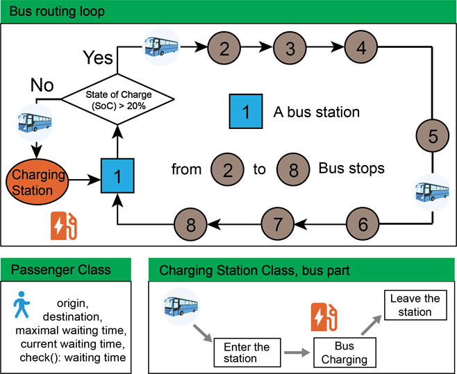


### 3.3.3 Passenger module

The passenger module describes the decision-making process of passengers while traveling to and from the transportation hubs. The module consists of five components: trip generation, time/cost-based split model, queuing structure, passenger departure as well as bus/taxi departure. The implemented passenger activity module in our simulator is described in the figure below.

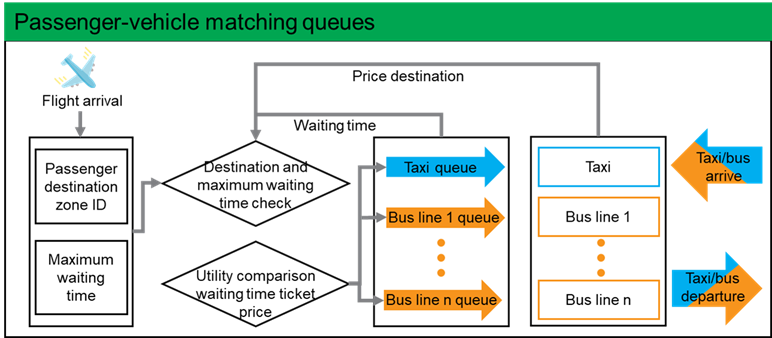

### 3.3.4 Traffic simulation module

 The traffic simulation module is based on the previous A-RESCUE module. A-RESCUE 3.0 is an agent-based road traffic simulator specifically designed for urban hurricane evacuation simulation ([https://github.com/umnilab/A_RESCUE](https://github.com/umnilab/A_RESCUE)). It is created as a part of the NSF-funded [Hazard SEES](https://www.nsf.gov/awardsearch/showAward?AWD_ID=1520338)  project.  Details about the car following model and routing information can be founded [here](https://github.com/umnilab/A_RESCUE#input-data). 

### 3.3.5 Energy calculation module

For gasoline vehicles, there were several well-developed and documented methods such as MOVES proposed by the Energy and Environmental Protection Agency. This method described vehicle gas consumption and emissions based on VSP (vehicle specific power), velocity, and acceleration. For the case of Electric Vehicles (EV), there was no unified process that describes the energy consumption as a function of their VSP and velocity. This was due to the fact that EV is an emerging technology, and most of these procedures are still under research. Nevertheless, in the literature, there existed a high variety of approaches to measure the energy consumption of EVs. In general, the literature on EV energy calculation was divided into three main branches: the physics-based models, the statistical regression models, and the machine learning models. Given that in this work we would consider different vehicle technologies and characteristics, we decided to focus on the physics-based models with direct parameter inputs, which can capture the impact of different vehicle characteristics, acting forces, and vehicle dynamics. Considering the model complexity and the validation performance with real vehicle consumption, we decided to choose the Fiori energy calculation methodology [1] for the project. The utilized test vehicle type was the Nissan Leaf, which is one of the most used vehicle types in the literature.

### 3.3.6 Demand prediction

Initially, prediction models were formulated for the total outgoing hourly ridership for all three hubs. The feature set is based on weather information, time and date feature, the recent history of arrivals, and the recent history of outgoing traffic. In addition to linear models engineered in the earlier work, we explored the nonlinear models to see if they can improve the performance. 

We designed an LSTM model for taxi zone level ridership prediction. The model consists of an aggregation layer, LSTM layers, and a dis-aggregation layer. The aggregation layer performs matrix multiplication that transforms the data from taxi zone space to community space, this layer is fixed and initialized to 24 community partitions. Each LSTM layer contains a stack of LSTM cells that consumes the sequential data in community space and outputs the prediction in low dimensional latent space. The disaggregation layer is a linear transformation (fully connected layer without non-linearity) that projects the prediction to taxi zone space. The whole model was trained end-to-end using Adam optimizer. Bayesian optimization was used to tune hyper-parameters like the time window size, the number of LSTM layers, and the learning rate.

## 4 Structure of HPC module

### 4.1 HPC framework

The HPC module is connected with multiple simulation instances that can run and send data over a socket to a remote host to analyze and build useful machine learning models. All these connections are managed by the *RemoteDataClientManager* (i.e. RDCM). RDCM's job is to manage these data senders (i.e. multiple simulation instances) and receive their data to separate buffer to be used by the ML algorithms. RDCM is independent of the simulator and runs as a separate process. 

- RemoteDataClient Class

This class is the client end of the data communication with the simulation instance. When the simulator sends messages RemoteDataClient receives them (whenever a client receives a message its `OnMessage` method is invoked. For each simulation instance, there is a dedicated RemoteDataClient.

- RemoteDataClientManager Class

This class is used to manage all the RemoteDataClients. Each RemoteDataClient is executed in a separate thread. All the data analysis routines must be called from this class (i.e. ML algorithms).

## 4.2 HPC module

### 4.2.1 Eco-routing module

The online energy-efficient routing aims to find the paths with minimal expected energy consumption for multiple EVs (EV taxis and EV buses), which is developed from the sample-efficient online algorithms and the combinatorial multi-arm bandit problem (CMAB) [2]. Specifically, we make use of the information obtained from the simulation side to update our eco-routing strategy, as shown as below.

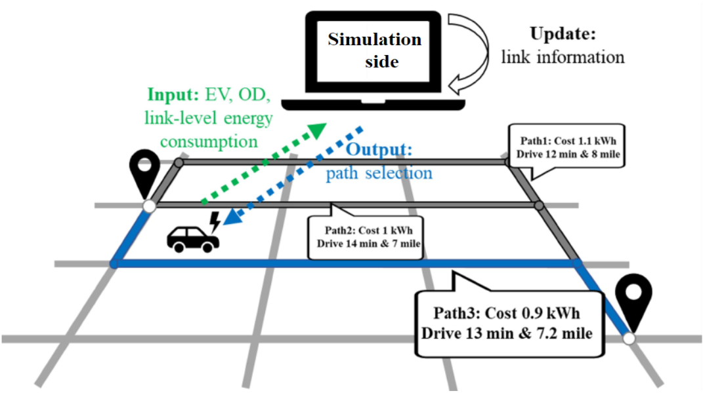

We extended the online eco-routing module to implement the energy-optimal online routing module for AEV buses. Given the scarce observation for bus energy consumption, this module (the routing side) took both AEV bus energy consumption and the AEV taxi’s speed as the input. Then a “shadow bus” was created based on the received speed profile and the corresponding energy consumption was estimated based on the energy model of the AEV bus.

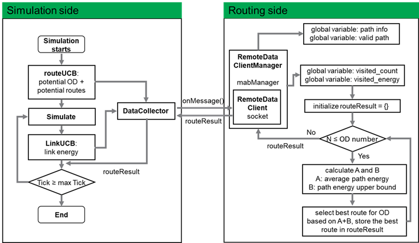

### 4.2.2 Ridesharing module

The hub-based ridesharing module takes the input as the origin-destination matrix of the waiting passenger and the number of available vehicles, then it outputs the schedules for vehicles to serve to a collection of passengers. In the simulation, we introduced a HashMap of Queue to store passenger information to facilitate the encoding/decoding of the input/output data and implemented the myopic ridesharing algorithm to match passengers with the same destination together.

### 4.2.3 Bus scheduling module

The demand-adaptive transit planning module generated the AEV transit routes and the corresponding E-bus schedules using hourly based predicted travel demand from or to the hubs. The demand prediction module was implemented in Python and it stored the demand as a CSV table that can be indexed by hub, date, hour, and taxi zone. The simulator then read this table and got the demand for a given configuration (hub, hour, date). The result of the demand prediction module served as the input of the AEV transit planning and scheduling algorithms, and the outputs are the AEV transit routes and the numbers of assigned AEV buses on different routes.

As shown in the following figure , for every two hours in the simulation, the BusPlanningManager class first receives the predicted travel demand messages from the simulator via [Rdcm.py](http://rdcm.py/). Then, it calls the route_generation.run() function under the RouteGeneration class to obtain the location of generated routes, and then calls the route_optimization.run() function under the RouteOptimization class to get the number of assigned buses on each route. Finally, the route locations and numbers of buses information are sent back to the simulation via the RDCM in the HPC module.

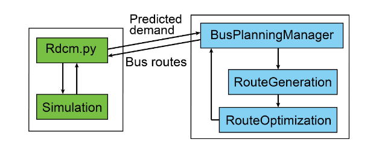

## 5 Visualization module

A web-based visualization module is developed to display simulation information. It is written using [React](https://reactjs.org/) with layers powered by [Deck.gl](https://deck.gl/). An online demo is available at [https://engineering.purdue.edu/HSEES/METSRVis/](https://engineering.purdue.edu/HSEES/EvacVis/).


The visualization module consists of five components:

1. Energy map: The energy map shows the vehicle locations, facilities, and link status. The vehicle locations can be displayed as icons or as a heat map. For the link status, the user can choose among speed (mph), total energy consumed by crossing EVs (kwh), and energy efficiency (kwh/mile). In addition, by hovering the individual vehicle icon, the user can check the detailed information such as the battery level and the number of served passengers; The user can also hover the link to see the link flow and link energy consumption.
2. Control panel: In the control panel, the user can choose the layer to display in the energy map. The control panel also allows the user to control the play speed of vehicle movement and to adjust the visualization to any simulation time.
3. Performance charts: The performance charts show the dynamics of the relevant metrics. In the current version, we display the total energy consumption of vehicle movements (kWh) and the number of served passengers.
4. Connection: The connection panel allows the user to input the URL of the data source for the visualization.
5. Legend: The legend panel shows the example of different elements in the energy map.

## 6 Output & logs

log4j is a fast thread safe logger for java. For the simulator, the main logger is initialized in ContextCreator.java. Log messages are written to both stdout and a log file named ADDSEVS.log.

Logging levels in the increasing order of severity are given below.

- `ALL` : All levels including custom levels.
- `DEBUG` : Designates fine-grained informational events that are most useful to debug an application.
- `INFO` : Designates informational messages that highlight the progress of the application at a coarse-grained level.
- `WARN` : Designates potentially harmful situations.
- `ERROR` : Designates error events that might still allow the application to continue running.
- `FATAL` : Designates very severe error events that will presumably lead the application to abort.
- `OFF` : The highest possible rank and is intended to turn off logging.

Desired levels can be set in log4j.properties file located in the root directory.

```
log4j.logger.addsevs.ContextCreator=DEBUG, addsevs, stdout
```

If you want to log only the ERROR or above levels you can set DEBUG to ERROR

## 7 Development history

We document changes by 6 categories which are: 1. City, including road and lanes; 2. Vehicles; 3. Charging stations; 4. Zones and airport; 5. Data collector; 6. Event Scheduler. Each category is further divided into three parts: Added, Modified, and Discarded.

### 7.1 Move from A-RESCUE to EV simulation

**September 20th, 2019 to October 3rd, 2019** Read the code, create a document of EV simulator 

**October 11th, 2019 to November 11th, 2019**

*City*

- Added
    
    **ContextCreator.build()**,  add two schedulers: schedulePassengerArrivalAndServe, and scheduleChargingStation.
    
    **ContextCreator.getChargingStationContext()**, return charging station context.
    
    **ContextCreator.getChargingStationGeography()**, return charging station geography.
    
    **CityContext.findChargingStationWithID()**, return the nearest charging station.
    
- Modified
    
    **Road.step()**, call udpateBatteryLevel to ****update the vehicle battery for each move.
    
    *Vehicles*
    
- Added
    
    **ElectricVehicles.class**, the major variables are batteryLevel_, mass_, avgPersonMass_; the major functions are updateBatteryLevel(), servePassenger(), setReachDest(). setReachDest() will be called whenever an EV is arriving a charging station (case 1) or its destination (case 2). For case 1, we call receiveVehicle in ChargingStation class; for class 2, we add EV back to each zone, and called the vehicle.setReachDest().
    
- Modified
    
    **Vehicle.setReachDest**(), originally this will call killVehicle() and destroy this instance, now it just calls leaveNetwork().
    
    **VehicleContext.createVehicleContextFromZone**(*zoneGeography, vehicleGeophy, num_vehicle*), instead of generating vehicle by evacuation plan, now it generate *num_vehicle* vehicles for each zone.
    
- Removed
    
    **Vehicle.vehicleGeography**. This instance is equal to the global value vehicleGeography so there is no point to have a local variable stored for each vehicle.
    

*Charging Stations*

- Added
    
    **ChargingStation.class**, the geographical part is the same as  Zone.class, except the intergerID for ChargingStation is negative. For other parts, we have L2 and L3 chargers and maintain four queues of vehicles: queueChargingL2 and queueChargingL3 for waiting vehicles, chargingVehicleL2 and chargingVehicleL3 for vehicles in charging. ChargingStation.receiveVehicle(*ElectricVehicle*) will add vehicles to corresponding queues based on a logit model. For each interval, each station will update the battery of charging vehicles and assign waiting vehicles to empty chargers by chargeL2() and chargeL3().
    
    **ChargingStationContext.class**, initialize charging station via a shapefile (For now we use ZONES_SHAPEFILE), similar to ZoneContext except the intergerID is negative.
    

*Zones and airport*

- Added
    
    **Passenger.class**, each passenger has its own origin, destination, maxWaitingTime and currentWaitingTime, passenger.check() would return true if the maxWaitingTIme has exceeded the currentWaitingTime, otherwise false.
    
    **LinkedBlockingQueue<Passenger> Zone.passQueueForTaxi**, passenger queue for taxis.
    
    **LinkedBlockingQueue<Passenger> Zone.passQueueForBus**, passenger queue for buses.
    
    **float Zone.passArrivalRate**, passenger arrival rate.
    
    **ArrayList<float> Zone.destDistribution**, destination distribution of trips from this zone (for the airport, replace this variable with more sophisticated demand generation model)
    
    **ArrayList<float> Zone.busTicketPrice**, price for bus to each destination.
    
    **Zone.generatePassenger**, generate Passenger according to passArrivalRate and destDistribution. Then based on busTicketPrice and travel time decide the travel mode. Add passenger to the Taxi / Bus queue.
    
    **Zone.servePassengerByTaxi**, serve passengers via taxis based FCFS (first come first serve) rule.
    
    **Zone.servePassengerByBus**, serve passengers via buses based FCFS (first come first serve) rule.
    
    **Zone.passengerWaitTaxi**, increase the passenger waiting time by one interval, and call Passenger.check() to decide whether to remove this passenger.
    
    **Zone.passengerWaitBus**, increase the passenger waiting time by one interval, and call Passenger.check() to decide whether to remove this passenger.
    
    **Zone.step**, organize zone step, first call servePassenger, then call passengerWait.
    
- Modified
    
    **Plan.class**, add a new parameter “location” that stores the coordinates, thus allowing the vehicle to go to places other than zones (e.g. Charging stations).
    
- Removed
    
    ****House.class,** transfer all attributes and functions into Plan class.
    
    **Zone.setHouses()**, previously each house represents an evacuation plan and this function will initialize a list of houses for each zone.
    
    **Zone.totalevacuationvehicles** replaced by another system of metrics, including numberOfServedPass, numberLeavePass, and totalPassWaitingTime.
    

*Data collector*

- Modified
    
    **JsonOutputWriter**, add a new field **batteryLevel** in the output field.
    

*Event Scheduler*

- Added
    
    **ContextCreator.schedulePassengerArrivalAndServe()**, regularly call Zone.generatePassenger() by SIMULATION_PASSENGER_ARRIVAL_INTERVAL, regularly call Zone.step() by SIMULATION_PASSENGER_SERVE_INTERVAL
    
    **ContextCreator.scheduleChargingStation()**, call ChargingStation.step() for every SIMULATION_CHARGING_STATION_REFRESH_INTERVAL ticks.
    

Simulation Driver

- Added
    
    Following functions were added and all of them are called appropriately inside   build(Context<Object> context) method.
    
    readPropertyFile();
    
    handleSimulationSleep();
    
    buildSubContexts();
    
    scheduleStartAndEnd();
    
    scheduleRoadNetworkRefresh();
    
    scheduleFreeFlowSpeedRefresh();
    
    scheduleNetworkEventHandling();
    
    schedulePassengerArrivalAndServe();
    
    scheduleChargingStation();
    
    scheduleMultiThreadedRoadStep();
    
    scheuleSequentialRoadStep()
    
    scheduleDataCollection();
    
- Removed
    
    Previous all the scheduling functions were done inside a single method called build(Context<Object> context). All the code inside was split into separate meaningful functions.
    

**November 11th, 2019 to December 11th, 2019**

*Vehicles*

- Added
    
    **Bus. construction function of bus,** the Bus class is an extension of the Vehicle class. Each bus has a sequence of bus stops. And the bus stops are located at the center of the zones and are labeled with the zone id.
    
    **Bus. set InitialParams(),** we set the full electricity capacity of the bus to be 300 kWh, and  the bus recharges itself when the electricity is below 20 percent, 60kWh. The bus weight is set to be 30,000 lbs. The number of seats is 40.
    
    **Bus. updateBatteryLevel():** the process is the same as the electric vehicle class.
    
    **Bus. setReachDest():** There are three cases: 1) The bus arrives at the charging station; 2) The bus arrives at the bus station and the SOC is less than 20%; 3) The bus arrives at other bus stops, or arrives at the bus station with SOC > 20%. For the first case, it is analogous to the charging process of Electric Vehicles. When the bus arrives at the charging station, it continues to run or goes to the charging station. In addition, when the bus arrives at the stop or station, drop off the passengers and call the **Bus.servePassenger()** function.
    
    **Bus. chargeItself():** charge the bus.
    
    **Bus.departure()**, add the bus to the closest road class, after that, the road.step() will take care of the bus running on the road. This function is called whenever a bus switches its destination.
    
- Modified
    
     **Bus.setReachDest()**, add the call of bus.departure(), note that the third parameters of bus.addPlan(destID, destCoord, **minutes to trigger this plan**) can be used to simulate the time table of buses.
    
    **Bus.servePassenger()**, first calculate the number of available seats, then invoke Zone.servePassengerByBus(# of available seats) to obtain a list of passengers that are being served, finally add these passengers to the passenger list based on their destinations.
    
    **VehicleContext.createBusContextFromZone()**, initialize Buses for each route, the inputs are zoneGeography, vehicleGeography,  **ArrayList<ArrayList<Integer>>routes, ArrayList<Integer>vehicle_nums**.
    

Charging stations

- Added

**chargingStation.receiveBus()** it is called by the setReachDest() in the Bus class.

**chargingStation.chargeBus()** There is a queue for bus charging. For each time step, charge the vehicles in the charging areas, and buses in the queue enter the charging areas.

*Zones and airport*

- Modified

**Zone.servePassengerByBus()**, assume each zone is covered by one bus lane, take the number of passengers as input, output the list of passengers to be served.

**December 12th, 2019 to February11th, 2020, Energy model profiling**

**February 11th, 2020 to March11th, 2020**

**Simulation debugging:**

1. **setNextRoad(), bug from the map.**
2. **ConcurrentModificationException.**

**March 11, 2020 to June 2, 2020**

1. **HPC framework**
2. **MAB manager**

**June 3, 2020 to September, 2020**

**Implementation of eco-routing for electric buses.**

The implementation of the key components is done.

### 7.2 HPC module (from JAVA to Python)

The raw HPC modules are implemented in JAVA, and the development team transfers them into the Python version.   

- **January, 2021 to March , 2021**

        Transferring of demand prediction module from Java to Python.

- **March, 2021 to May, 2021**

        Transferring of eco-routing module from Java to Python.

- **May, 2021 to August, 2021**

        Transferring of bus-scheduling module from Java to Python.

- **August, 2021 to October, 2021**

        Transferring of ride-sharing module from Java to Python.

The implementation of the HPC modules in Python is done.

## 8 Publications and References

### 8**.1 Publications**

[1] Lei et al. (2021). ADDS-EVS: An agent-based deployment decision-support system for electric vehicle services. IEEE ITSC 2021

[2] Chen et al. (2020). Online Energy-optimal Routing for Electric Vehicles with Combinatorial Multi-arm Semi-Bandit. IEEE ITSC 2020

[3] Lei, Z., Qian, X., & Ukkusuri, S. V. (2020). Efficient proactive vehicle relocation for on-demand mobility service with recurrent neural networks. Transportation Research Part C: Emerging Technologies, 117, 102678.

[4] Qian et al. (2020). Impact of transportation network companies on urban congestion: evidence from large-scale trajectory data. Published in Sustainable Cities and Society.

[5] Stanislav Sobolevsky et. al. (2019). Anomaly detection in temporal networks. NetSci, May, 2019, Burlington, VT, USA.

[6] Qian et al. (2019). Stationary spatial charging demand distribution for commercial electric vehicles in urban area. IEEE ITSC 2019.

[7] Lei et al. (2019). Optimal proactive vehicle relocation for on-demand mobility service with deep convolution-lstm network. IEEE ITSC 2019.

[8] Qian et al. (2019). Demand-adaptive transit design for urban transportation hubs. Accepted for presentation at 2020 TRB annual meeting.

[9] Qian et al. (2019). Charging Infrastructure Planning For Commercial Electric Vehicles Based on Stationary Spatial Demand Distribution. Accepted for presentation at 2020 TRB annual meeting.

[10] Qian et al. (2019). Understand the impact of transportation network companies on urban traffic using large-scale trajectory data. Accepted for presentation at 2020 TRB annual meeting.

### 8**.2 References**

[1] Fiori, C., Ahn, K., & Rakha, H. A. (2016). Power-based electric vehicle energy consumption model: Model development and validation. Applied Energy, 168, 257–268.

[2] Chen, W., Wang, Y., & Yuan, Y. (2013, February). Combinatorial multi-armed bandit: General framework and applications. In *International Conference on Machine Learning* (pp. 151-159). PMLR.
