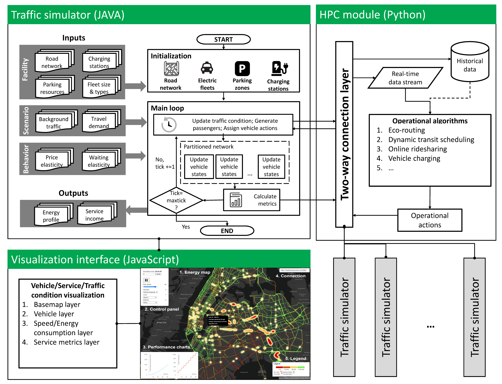

# Welcome to the METS-R simulator!

The **multi-modal energy-optimal trip scheduling in real-time (METS-R)** simulator is a high-fidelity, parallel, agent-based simulator for simulating large-scale electric vehicle services. 

<video src="https://user-images.githubusercontent.com/7522913/203042173-8eaa13db-bcdc-4fc3-aa54-40d3640fa6ee.mp4" data-canonical-src="https://user-images.githubusercontent.com/7522913/203042173-8eaa13db-bcdc-4fc3-aa54-40d3640fa6ee.mp4" controls="controls" muted="muted" class="d-block rounded-bottom-2 border-top width-fit" style="max-height:640px;">
</video>

# 1 Overall framework

The METS-R simulator consists of a traffic simulator module for EV services (including taxis and buses) and a remote data client manager (i.e., [control center](https://github.com/umnilab/METS-R_HPC)), multiple instances are connected under a single remote data client manager. The benefits of this framework are three-fold:

1. For testing some operational algorithms (e.g., reinforcement learning algorithms) that require large amounts of simulation trajectories, this framework has better data collection efficiency; 

2. For some operational algorithms that need to solve an optimization (e.g., ILP), this framework allows caching the solutions so one can reuse them in multiple simulation instances.

3. It mimics the real-world platform company scenario in which a cloud service is provided to coordinate riders/drivers.



# 2 Getting start

## 2.1 Quick start
1. Download the installer (the latest is `mets_r_v0.9.0.jar`) from the [the METS-R repository](https://github.com/umnilab/METS-R_SIM/releases/tag/0.9.0).
2. Double-click the installer and follow the instructions to decompress the METS-R SIM into a proper folder.
3. Go to that folder, and double click `start_model.bat` (in Linux use "start_model.command")
4. Click Run and you should see the below *Repast Symphony* simulation window (After specifying the first time, you can also use the *Run* button in the Eclipse toolbar).
    
    
    
5. Click on the *Start Run* button in the pop-up window to begin the simulation.
6. The simulation outputs can be found in the agg_output folder, and the vehicle trajectories are in the sim_output folder.
7. If required, you can modify the inputs of the simulation run scenario according to your needs in the configuration file (`METS_R/data/Data.properties`)

## 2.2 Load METS-R in an IDE
1. Download and install Eclipse IDE with *Repast Simphony* 2.7 from [here](https://github.com/Repast/repast.simphony/releases).
2. Clone the *METS-R* repository using git to a target folder.
    ```
    git clone https://github.com/umnilab/METS-R_SIM.git
    ```
The following steps only run the traffic simulator (built-in Java) without the HPC module. To run the HPC module, please follow the steps in *[Running HPC module]*.
1. Open Eclipse and go to File -> *Open Projects from File System…*
2. In the *Import Projects from File System or Archive* window click on *Directory* and open the *METS_R* directory you cloned in step 3.
3. Check *METS_R* and click *Finish*. This should open the METS-R SIM project in Eclipse as shown in the following figure.   
    
                                                            
    
4. Go to the *laucher* folder in the project explorer, then right click `METS_R Model.launch` and select Run as -> *METS-R Model* to start the simulation.

## 2.3 Running in an HPC environment (recommended)

1. Download the *METSR_HPC* code to run the HPC module.
    
    ```
    git clone git@github.com:umnilab/METSR_HPC.git
    cd METSR_HPC
    ```

3. Set up a *Python* (version >= 3.7) environment and install the packages in *requirements.txt*.
2. View the HPC configuration JSON file. Currently, you need the  `run.config.scenario.json` file with the configurations:
    - `java_path` - set the absolute path of your Java installation.
    - `java_options` - change the JVM memory limits depending on your machine specs.
    - `sim_dir` - the absolute path of METS_R directory.
    - `repast_plugin_dir` - the absolute path of your repast plugin installation.
    - `charger_plan` - the charging station plan.
    - `num_sim_instances` - the number of parallel simulation instances you need to run.
4. Finally, run
    ```
    python3 run_hpc.py -s 0 -c 0 -tf 2000 -bf 100
    ```
   More options can be found in the run_hpc.py.
    
5. This will start the simulation instances and run an RDCM (remote data client manager). All the files related to each simulation run will be created in a separate directory in the `output` folder.

## 2.4 Customize your inputs
### 2.4.1 Use your demand files

1. The demand prediction module is hosted in the METRS_HPC repo. Clone it if you have not done that.
2. Download and process the data required to train the models.
    
    ```
    git clone git@github.com:tjleizeng/METSR_HPC.git
    cd demand prediction
    python 1.Download_NewYork_Taxi_Raw_Data.py
    python 2.Process_NY_Taxi_Raw_data.py
    ```
    
3. You can change the `hub` variable in `2.Process_NY_Taxi_Raw_data.py` to get the prediction for different hubs (i.e. `PENN`, `JFK`, `LGA`).
4. Train the model and generate the prediction `.csv` file.
    
    ```
    python PCA_aggregation_RF_prediction.py
    ```
    
5. Same as before, change the `hub` variable as necessary. This will train the prediction model and write the prediction result to a file named `<HUB>PCA.csv`.
6. Java class `DemandPredictionResult.java` can be used to query the prediction result from within the simulator code. There are two main functions in this class:
    - `public double GetResultFor(String hub, String date, int hour, int taxiZone)` : This function can be used to query the prediction result. You need to specify the following to get the prediction result
        - `hub` : demand hub name (i.e. `PENN`, `JFK`, `LGA`)
        - `date` : use the format `<year>-<month>-<date>` (eg. `2018-12-31`)
        - `hour` : hour of the day 1-24
        - `taxiZone` : taxi zone number
    - `public void RefreshResult()` : Use this function to repopulate the prediction result from the `.csv` file. This is useful if you want to update the demand prediction while the simulator is also running.

### 2.4.2 Utilize dynamic bus scheduling planning

1. The bus scheduling module in the HPC part utilizes the gurobi package to solve the optimization problem. If you want to use the bus scheduling module, you need to install the packages of gurobi provided [here](https://www.gurobi.com/documentation/9.5/quickstart_mac/cs_python_installation_opt.html) and lapsolver provided [here](https://pypi.org/project/lapsolver/). 

2. With gurobi license, one can modify the [rdcm.py](http://rdcm.py) file to replace the prepared bus scheduling data `bus_scheduling_read` with the optimization algorithm to run the simulation.

3. For an alternative solution, one can also cache the optimization results, then load it during the simulation. This is the current default option, which does not need gurobi.

```
bus_scheduling_read_raw = open(bus_scheduling_read)
busPlanningResults = json.load(bus_scheduling_read_raw)
```
# 3. A little more detail

## 3.1 Input

All the required inputs for running the simulation are listed and described in the configuration file `METS_R/data/Data.properties`. The paths of the input data are provided in the first section of the file. Below are the details of each input:

1. `Zone shapefile (Point)`: the locations of origins/destinations of all demand. One also needs to specify the number of zones in `NUM_OF_ZONES`  in `Data.properties` and which zones are corresponding to the hubs in the variable  `HUB_INDEXES` in `addsEVs.GlobalVariables.java`. For example, `HUB_INDEXES=[131,140,180]` means the 131th row (JFK), 140th row (LGA), and 180th row (PENN) of the zone shape are corresponding to transportation hubs. 
2. `Charging station shapefile (Point)`:  similar to the zone shapefile, this is the shapefile for charging stations. For a given scenario, a CSV file needs to be specific for the variable `CHARGER_CSV` to configure the chargers in each charging station. It has to have at least two rows for each charger to specify the ID of the charger (in the same order as in the shapefile) and the number of the (L2) chargers. 

3. `Road shapefile (Polyline)`: map of the roads. Should contain the information on which lane belongs to which road. E

4. `Lane shapefile (Polyline)`: map of the lanes, generated from road shapefile. This shapefile should contain lane connection information. 

5. `Demand profiles (CSV/JSON)`: OD flow for different hours of the day, which is a matrix (stored as a JSON file) with m rows and n columns, m corresponds to the number of OD pairs, and n corresponds to the number of hours to simulate.

6. `Background traffic speed (CSV)`: the background traffic speed (in miles/h) of each link in different hours of the day. This is for compensating the impact of the traffic that is not simulated.

### 3.2 Output data

1. The aggregated output data generated in the folder `agg_output/`  records the number of served requests by taxis and EVs, the trip numbers, the passenger waiting time, and the energy consumption. Such output files are stored under the agg_output file folder, including `Buslog.csv`,`Chargerlog.csv`,`EVlog.csv`, `Linklog.csv`, `Networklog.csv`, and `Zonelog.csv`. 
    a.`Networklog.csv` summarizes the overall operational information of the entire system, the fields of `Networklog.csv` file are:
    - `tick` is the simulation time tick.
    - `vehOnRoad` is the current number of on-road EV taxis.
    - `emptyTrip` is the cumulative number of empty trips performed by EV taxis.
    - `chargingTrip` is the cumulative number of charging trips performed by EV taxis.
    - `generatedTaxiPass` is the total number of generated taxi requests.
    - `generatedBusPass` is the total number of generated bus requests.
    - `generatedCombinedPass` is the total number of generated bus-taxi integrated requests.
    - `taxiPickupPass` is the total number of taxi requests got onboard.
    - `busPickupPass` is the total number of bus requests that got onboard.
    - `combinePickupPart1` is the total number of combined requests that got onboard in the first trip.
    - `combinePickupPart2` is the total number of combined requests that got onboard in the second trip.
    - `taxiServedPass` is the total number of taxi requests served (arrived).
    - `busServedPass` is the total number of bus requests served (arrived).
    - `taxiLeavedPass` is the total number of taxi requests that left the system unserved.
    - `busLeavedPass` is the total number of bus requests that left the system unserved.
    - `numWaitingTaxiPass` shows the current number of requests who are waiting for EV taxis.
    - `numWaitingBusPass` shows the current number of requests who are waiting for EV buses.
    - `timeStamp` shows the time of the record (in milliseconds).
    
    b. The attributes of `Zonelog.csv` file are:
    - `tick` is the simulation time tick.
    - `zoneID` is the index of the corresponding pickup/drop-off zone.
    - `numTaxiPass` is the current number of EV taxi requests.
    - `numBusPass` is the current number of EV bus requests.
    - `vehStock` is the cumulative number of charging trips performed by EV taxis.
    - `taxiGeneratedPass` is the total number of generated taxi requests in the zone.
    - `taxiServedPass` is the total number of taxi requests served in the zone.
    - `taxiLeavedPass` is the total number of taxi requests that left the zone unserved.
    - `taxiPassWaitingTime` shows the cumulative waiting time of served taxi requests.
    - `busGeneratedPass` is the total number of generated bus requests in the zone.
    - `busPassWaitingTime` is the total number of generated bus requests in the zone.
    - `busServedPass` is the total number of bus requests served in the zone.
    - `busLeavedPass` is the total number of bus requests that left the zone unserved.
    - `busPassWaitingTime` shows the cumulative waiting time of served bus requests.
    - `taxiWaitingTime` is the cumulative idling time of EV taxis in the zone.
    
    c. The attributes of `Linklog.csv` file are:
    - `tick` is the simulation time tick.
    - `linkID` is the index of the road.
    - `flow` is the cumulative times of EV traveling across the link.
    - `consumption` is the cumulative energy EV consumed on that link.
    
    d. The attributes of `EVlog.csv` file are:
    - `tick` is the simulation time tick.
    - `vehicleID` is the index of the EV taxi.
    - `tripType`, 1 stands for occupied trip, 2 for repositioning trip, 4 for charging trip.
    - `originID` is the index of the original zone.
    - `destID` is the index of the target zone.
    - `distance` is the distance (m) traveled.
    - `departure time` is the departure time of the trip.
    - `cost` is the energy consumed by the trip
    - `choice` is the choice of routes among the candidates if eco-routing is enabled.
    - `passNum` is the number of requests.
    
    e. The attributes of `Buslog.csv` file are:
    - `tick` is the simulation time tick.
    - `vehicleID` is the index of the EV bus.
    - `routeID` is the index of the transit route that the EV bus is following.
    - `tripType`, 3 for regular trips, 4 for charging trips.
    - `originID` is the index of the original zone.
    - `destID` is the index of the target zone.
    - `distance` is the distance (m) traveled.
    - `departure time` is the departure time of the trip.
    - `cost` is the energy consumed by the trip
    - `choice` is the choice of routes among the candidates if eco-routing is enabled.
    - `passOnBoard` is the number of requests on the EV bus.
    
    f. The attributes of `Chargerlog.csv` file are:
    - `tick` is the simulation time tick.
    - `chargerID` is the index of the EV chargers.
    - `vehID` is the index of the charging vehicles.
    - `chargerType` shows the type of the chargers, can be L2, L3, or Bus.
    - `waitingTime` is the time that the charging vehicles spent in the charging queue.
    - `chargingTime` is the time between the start of charging and the time of full charge.
    - `initialBatteryLevel` is the initial battery level (kWh) of the charging vehicles.
    
2. One can toggle the `ENABLE_JSON_WRITE` to enable the collection of vehicle trajectory files, which are stored in `trajectory_output/`and are the necessary inputs for the visualization module. Each JSON object within each file stores the following information for each snapshot period:
    1. ev:  the trajectory of EV taxis, including its coordinates, speed, battery level, origin, destination, current link, and number of requests
    2. bus: the trajectory of EV buses, including its coordinates, speed, battery level, current link, and number of onboard requests
    3. pass: number of newly served requests.
    4. link: linkID, cumulative flow, average speed, cumulative energy consumption aggregated by link

## 3.3 Preparation of road shapefile and lane shapefile

The data preparation is fulfilled by scripts located in `METS_R/data/data_preparation`. 

The way of using it is by opening the `METS_R/util/map preparation/run.py` file and changing the name of the files to use as inputs. These files should have the information requirements: road shape should be composed of polylines and must have the following fields included: 

- `SPEED(number)`: speed limit in mph
- `OneWay(String)`: direction field. if FT: means that the draw direction equals the real direction of the road, if TF: means that the drawing direction is contrary to the real road direction if none means bidirectional
- `FromZlev(number)`: a number indicating the initial level (z) of the initial point of the road in this case an integer
- `ToZlev(number)`: a number indicating the final level (z) of the initial point of the road in this case an integer
- `Shape_Leng(number)`: length of road in m
- `st_width(number)`: width of the road (including all lanes) in feet
- `snow_pri(string)`: a letter indicating the priority of the road can be any letter
- `bike_lane(number)`: field indicating if a road has a bike lane

The elevation file should be a point shape with the following fields: 

- `fid(number)`: identity number ‘elevation’(number): Height of point in feet

As a response to this code, a new folder or an indicated folder will be created with 10 new shapes, each shape is different. The whole process consists of a set of steps to identify the presence of bridges, remove 5-leg intersections, assure strong connectivity, and add information such as elevation.

## 3.4 Visualization module

A web-based visualization module is developed to display simulation information. It is written using [React](https://reactjs.org/) with layers powered by [Deck.gl](https://deck.gl/). An online demo is available at [https://engineering.purdue.edu/HSEES/METSRVis/](https://engineering.purdue.edu/HSEES/EvacVis/).


# 4 Publications 

[1] Lei et al. (2024). METS-R SIM: A simulator for Multi-modal Energy-optimal Trip Scheduling in Real-time with shared autonomous electric vehicles. Simulation Modelling Practice and Theory, 132, 102898.

[2] Chen et al. (2022). Online eco-routing for electric vehicles using combinatorial multi-armed bandit with estimated covariance. Transportation Research Part D: Transport and Environment, 111, 103447.

[3] He et al. (2022). Ridership prediction and anomaly detection in transportation hubs: an application to New York City. The European Physical Journal Special Topics, 231(9), 1655-1671.

[4] Lei et al. (2021). ADDS-EVS: An agent-based deployment decision-support system for electric vehicle services. IEEE ITSC 2021

[5] Qian et al. (2020). Demand-adaptive route planning and scheduling for urban hub-based high-capacity mobility-on-demand services. arXiv preprint arXiv:2008.10855.

[6] Chen et al. (2020). Online Energy-optimal Routing for Electric Vehicles with Combinatorial Multi-arm Semi-Bandit. IEEE ITSC 2020

[7] Lei, Z., Qian, X., & Ukkusuri, S. V. (2020). Efficient proactive vehicle relocation for on-demand mobility service with recurrent neural networks. Transportation Research Part C: Emerging Technologies, 117, 102678.

[8] Qian et al. (2020). Impact of transportation network companies on urban congestion: evidence from large-scale trajectory data. Published in Sustainable Cities and Society.

[9] Stanislav Sobolevsky et. al. (2019). Anomaly detection in temporal networks. NetSci, May, 2019, Burlington, VT, USA.

[10] Qian et al. (2019). Stationary spatial charging demand distribution for commercial electric vehicles in urban area. IEEE ITSC 2019.

[11] Lei et al. (2019). Optimal proactive vehicle relocation for on-demand mobility service with deep convolution-lstm network. IEEE ITSC 2019.

[12] Qian et al. (2019). Demand-adaptive transit design for urban transportation hubs. Accepted for presentation at 2020 TRB annual meeting.

[13] Qian et al. (2019). Charging Infrastructure Planning For Commercial Electric Vehicles Based on Stationary Spatial Demand Distribution. Accepted for presentation at 2020 TRB annual meeting.

[14] Qian et al. (2019). Understand the impact of transportation network companies on urban traffic using large-scale trajectory data. Accepted for presentation at 2020 TRB annual meeting.
